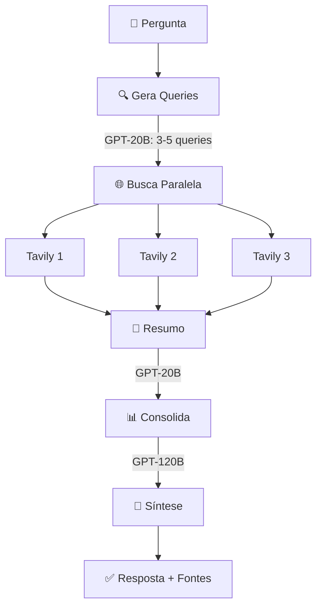
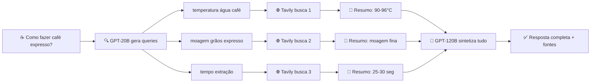

# Clone Perplexity - Motor de Busca Inteligente

> Sistema de busca que combina IA generativa com pesquisa web em tempo real

---

## 📋 Sobre

Motor de busca que transforma perguntas em pesquisas paralelas, sintetizando informações em respostas completas com citações automáticas.

**Principais recursos:**
- 🔄 Busca paralela em múltiplas fontes
- ⚡ Duas LLMs: GPT-20B (queries + resumos) e GPT-120B (síntese final)
- 💾 Estado persistente (LangGraph v1.0)
- 📚 Citações automáticas

---

## ⚙️ Instalação

```bash
git clone https://github.com/DaviSantiago01/perplexity-clone.git
cd perplexity-clone

python -m venv venv 

# Linux/Mac:
source venv/bin/activate

# Windows (CMD):
venv\Scripts\activate.bat

# Windows (PowerShell):
venv\Scripts\Activate.ps1

pip install -r requirements.txt
```

**Configure suas APIs** (gratuitas): [Groq](https://console.groq.com/keys) • [Tavily](https://tavily.com/#api)

```bash
# Crie .env
GROQ_API_KEY=sua_chave
TAVILY_API_KEY=sua_chave
```

---

## 🚀 Uso

```bash
# CLI
python main.py

# Web UI
streamlit run app.py
```

---

## 📁 Estrutura

```
perplexity-clone/
├── main.py              # CLI
├── app.py               # Streamlit UI
└── src/
    ├── config.py        # Configurações
    ├── models.py        # TypedDict
    ├── prompts.py       # Templates
    ├── graph.py         # LangGraph workflow
    └── services.py      # Groq + Tavily
```

---

## 🏗️ Como Funciona



**Fluxo:** Pergunta → Queries (20B) → Busca Paralela → Resumos (20B) → Síntese (120B) → Resposta

---

## 💡 Exemplo

**Input:** `"Como fazer café expresso?"`

**Processamento:**



1. Sistema gera 3 queries otimizadas
2. Busca paralela em cada uma
3. Resume resultados individuais (GPT-20B)
4. Sintetiza resposta completa (GPT-120B)

**Output:**
```
Para café expresso perfeito:
- Moagem fina e uniforme [1]
- Água a 90-96°C [2]
- Dose: 18-20g de café
- Extração: 25-30 segundos [3]

Resultado: crema dourada e sabor equilibrado.

[1] barista-institute.com/guia-expresso
[2] coffeeresearch.org/temperature
[3] specialtycoffee.com/timing
```

---

---

## Créditos

Projeto inspirado no tutorial da [Asimov Academy](https://www.youtube.com/@AsimovAcademy). Vídeo original: [Crie um Clone do Perplexity AI com LangGraph](https://www.youtube.com/watch?v=q2XPEjQ4Yt0). Esta versão foi atualizada para LangGraph v1.0 e LangChain v1.0.