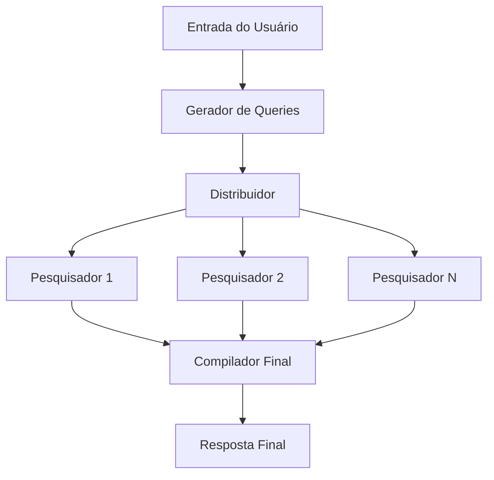

# 🔍 Perplexity Clone - Ollama + LangGraph

[](https://python.org)
[](https://langchain-ai.github.io/langgraph/)
[](https://ollama.ai/)
[](https://streamlit.io/)
[](https://opensource.org/licenses/MIT)

> 🚀 **Clone do Perplexity AI** construído com **LangGraph**, **Ollama** e **Tavily** para pesquisa inteligente com IA local

<div align="center">
  
  
  
</div>

---

## 📋 Sobre o Projeto

**Perplexity Clone** é uma implementação completa de um sistema de pesquisa inteligente similar ao Perplexity AI, que combina o poder da IA local com pesquisa web em tempo real.

### ✨ Principais Características

- 🌐 **Busca web em tempo real** via API Tavily
- 🤖 **Processamento local de IA** usando modelos Ollama
- 🔄 **Workflow complexo** gerenciado pelo LangGraph
- 💻 **Interface web interativa** com Streamlit
- 🚀 **Processamento paralelo** para máxima eficiência
- 📚 **Referências completas** com links verificáveis

### 🎬 Demonstração

```bash
# Exemplo de pergunta
"Como funciona o machine learning?"

# O sistema automaticamente:
# 1. Gera queries: ["machine learning basics", "ML algorithms", "neural networks"]
# 2. Pesquisa simultaneamente na web
# 3. Extrai e resume conteúdo relevante
# 4. Compila resposta abrangente com fontes
```

### 🎯 Como Funciona

1. **Geração de Queries**: O sistema recebe uma pergunta e gera múltiplas queries de pesquisa
2. **Pesquisa Paralela**: Cada query é pesquisada simultaneamente na web
3. **Extração e Resumo**: O conteúdo das páginas é extraído e resumido
4. **Síntese Final**: Todos os resultados são compilados em uma resposta abrangente

## 🏗️ Arquitetura LangGraph

O projeto utiliza o **LangGraph** para criar um workflow de agentes que trabalham em paralelo:



### 🔧 Componentes Principais

- **`build_first_queries`**: Gera múltiplas queries de pesquisa a partir da pergunta
- **`spawn_researchers`**: Distribui queries para execução paralela (fan-out)
- **`single_search`**: Executa pesquisa individual e extrai conteúdo
- **`final_write`**: Compila todos os resultados em resposta final (fan-in)

## 🚀 Instalação e Configuração

### Pré-requisitos

1. **Python 3.8+**
2. **Ollama** instalado e rodando
3. **Conta Tavily** para API de pesquisa web

### Instalação

1. Clone o repositório:
```bash
git clone <url-do-repositorio>
cd perplexity-ollama-clone
```

2. Instale as dependências:
```bash
pip install -r requirements.txt
```

3. Configure as variáveis de ambiente:
```bash
# Crie um arquivo .env
echo "TAVILY_API_KEY=sua_chave_tavily_aqui" > .env
```

4. Instale os modelos Ollama:
```bash
# Modelos necessários
ollama pull llama3.2:1b   # Modelo rápido para tarefas simples
ollama pull llama3.2:3b   # Modelo mais potente para síntese
```

### Execução

```bash
streamlit run graph.py
```

Acesse `http://localhost:8501` no seu navegador.

## 📁 Estrutura do Projeto

```
📦 perplexity-ollama-clone/
├── 📄 graph.py          # Arquivo principal com workflow LangGraph
├── 📄 schemas.py        # Estruturas de dados (Pydantic models)
├── 📄 prompts.py        # Templates de prompts para LLMs
├── 📄 requirements.txt  # Dependências Python
├── 📄 .env             # Variáveis de ambiente (API keys)
├── 📄 .gitignore       # Arquivos ignorados pelo Git
└── 📄 README.md        # Este arquivo
```

## 🔑 Variáveis de Ambiente

| Variável | Descrição | Obrigatória |
|----------|-----------|-------------|
| `TAVILY_API_KEY` | Chave da API Tavily para pesquisa web | ✅ |

## 🛠️ Tecnologias Utilizadas

- **[LangGraph](https://langchain-ai.github.io/langgraph/)**: Framework para workflows de agentes
- **[LangChain](https://langchain.com/)**: Toolkit para aplicações com LLM
- **[Ollama](https://ollama.ai/)**: Execução local de modelos de IA
- **[Tavily](https://tavily.com/)**: API de pesquisa web para IA
- **[Streamlit](https://streamlit.io/)**: Framework para aplicações web
- **[Pydantic](https://pydantic.dev/)**: Validação de dados

## 📊 Fluxo de Dados

1. **Input**: Pergunta do usuário via interface Streamlit
2. **Query Generation**: LLM gera 3-5 queries de pesquisa relacionadas
3. **Parallel Search**: Cada query é pesquisada simultaneamente via Tavily
4. **Content Extraction**: Conteúdo das páginas é extraído e resumido
5. **Final Synthesis**: LLM mais potente compila resposta final com referências
6. **Output**: Resposta formatada exibida na interface

## 🎨 Características

- ✅ **Processamento Local**: Usa modelos Ollama sem enviar dados para APIs externas
- ✅ **Pesquisa Paralela**: Múltiplas queries executadas simultaneamente
- ✅ **Referências**: Inclui links e fontes para verificação
- ✅ **Interface Intuitiva**: Web app simples e responsiva
- ✅ **Workflow Visualizável**: Grafo LangGraph pode ser visualizado

## 🔧 Personalização

### Modelos Ollama

Você pode alterar os modelos utilizados editando as linhas em `graph.py`:

```python
llm = ChatOllama(model="llama3.2:1b")        # Modelo rápido
llm_reasoning = ChatOllama(model="llama3.2:3b")  # Modelo potente
```

### Prompts

Os prompts podem ser customizados no arquivo `prompts.py` para diferentes domínios ou idiomas.

### Número de Resultados

Altere o número máximo de resultados por pesquisa em `single_search()`:

```python
results = tavily_client.search(query, max_results=3)  # Padrão: 1
```

## 🐛 Solução de Problemas

### Erro: "Ollama not found"
- Certifique-se que o Ollama está instalado e rodando
- Verifique se os modelos foram baixados: `ollama list`

### Erro: "Tavily API key invalid"
- Verifique se a chave está correta no arquivo `.env`
- Confirme que a conta Tavily está ativa

### Interface não carrega
- Verifique se todas as dependências estão instaladas
- Execute: `streamlit doctor` para diagnóstico

## 🤝 Contribuição

1. Fork o projeto
2. Crie uma branch para sua feature (`git checkout -b feature/AmazingFeature`)
3. Commit suas mudanças (`git commit -m 'Add some AmazingFeature'`)
4. Push para a branch (`git push origin feature/AmazingFeature`)
5. Abra um Pull Request

## 📝 Licença

Este projeto está sob a licença MIT. Veja o arquivo `LICENSE` para mais detalhes.

## 🙏 Agradecimentos

- Inspirado no [Perplexity AI](https://perplexity.ai/)
- Baseado no vídeo tutorial: [Recriei o PERPLEXITY AI usando LLMs locais](https://www.youtube.com/watch?v=q2XPEjQ4Yt0&t=585s)
- Comunidade LangChain e LangGraph

## 📞 Contato

Se você tiver dúvidas ou sugestões, sinta-se à vontade para abrir uma issue!

---

⭐ **Se este projeto foi útil, considere dar uma estrela!** ⭐