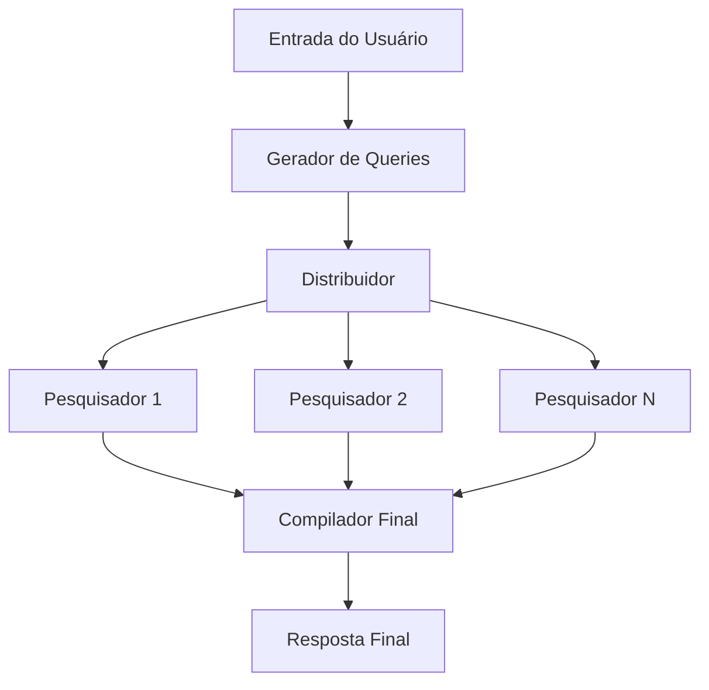

# 🔍 Perplexity Clone - Groq + LangGraph

[](https://python.org)
[](https://langchain-ai.github.io/langgraph/)
[](https://groq.com/)
[](https://streamlit.io/)
[](https://opensource.org/licenses/MIT)

> 🚀 **Clone do Perplexity AI** construído com **LangGraph**, **Groq LLMs** e **Tavily** para pesquisa inteligente ultrarrápida

<div align="center">
  
  
  
  
</div>

---

## 📋 Sobre o Projeto

**Perplexity Clone** é uma implementação completa de um sistema de pesquisa inteligente similar ao Perplexity AI, que combina o poder ultrarrápido dos **Groq LLMs** com pesquisa web em tempo real.

### ✨ Principais Características

- 🌐 **Busca web em tempo real** via API Tavily com conteúdo completo
- ⚡ **Processamento ultrarrápido** usando Groq LLMs (Llama 3.1/3.3)
- 🔄 **Workflow inteligente** gerenciado pelo LangGraph
- 💻 **Interface web moderna** com Streamlit e indicadores de progresso
- 🚀 **Processamento paralelo** otimizado para máxima eficiência
- 📚 **Referências completas** com links verificáveis e deduplicação
- 📝 **Código totalmente documentado** com comentários detalhados
- 🛡️ **Tratamento robusto de erros** e fallbacks automáticos
- 🔧 **Estado concorrente otimizado** com suporte a atualizações paralelas

### 🎬 Demonstração

```bash
# Exemplo de pergunta
"Como funciona o machine learning?"

# O sistema automaticamente:
# 1. Gera queries: ["machine learning basics", "ML algorithms", "neural networks"]
# 2. Pesquisa simultaneamente na web
# 3. Extrai e resume conteúdo relevante
# 4. Compila resposta abrangente com fontes
```

### 🎯 Como Funciona

1. **Geração Inteligente de Queries**: Groq Llama-3.1-8b-instant gera múltiplas queries otimizadas
2. **Pesquisa Paralela Avançada**: Cada query é pesquisada simultaneamente com `include_raw_content=True`
3. **Extração e Resumo Inteligente**: Conteúdo completo é extraído, limitado e resumido automaticamente
4. **Síntese Final Poderosa**: Groq Llama-3.3-70b-versatile compila resposta abrangente com fontes deduplicadas
5. **Controle de Tokens**: Limitação automática de conteúdo para otimização de performance

## 🏗️ Arquitetura LangGraph

O projeto utiliza o **LangGraph** para criar um workflow de agentes que trabalham em paralelo:



### 🔧 Componentes Principais

- **`build_first_queries`**: Gera múltiplas queries otimizadas usando Groq LLM rápido
- **`spawn_researchers`**: Distribui queries para execução paralela (fan-out pattern)
- **`single_search`**: Executa pesquisa Tavily com conteúdo completo e tratamento de erros
- **`final_writer`**: Compila resultados usando Groq LLM potente (fan-in pattern)
- **`deduplicate_and_format_sources`**: Remove duplicatas e formata fontes
- **`tavily_search`**: Interface robusta para API Tavily com controle de conteúdo

## 🚀 Instalação e Configuração

### Pré-requisitos

1. **Python 3.8+**
2. **Conta Groq** para acesso aos LLMs ultrarrápidos
3. **Conta Tavily** para API de pesquisa web

### Instalação

1. Clone o repositório:
```bash
git clone <url-do-repositorio>
cd perplexity-ollama-clone
```

2. Instale as dependências:
```bash
pip install -r requirements.txt
```

3. Configure as variáveis de ambiente:
```bash
# Crie um arquivo .env
echo "GROQ_API_KEY=sua_chave_groq_aqui" > .env
echo "TAVILY_API_KEY=sua_chave_tavily_aqui" >> .env
```

4. Obtenha suas chaves de API:
   - **Groq**: Acesse [console.groq.com](https://console.groq.com) e crie uma chave gratuita
   - **Tavily**: Acesse [tavily.com](https://tavily.com) e registre-se para obter a chave

### Execução

```bash
streamlit run graph.py
```

Acesse `http://localhost:8501` no seu navegador.

## 📁 Estrutura do Projeto

```
📦 perplexity-groq-clone/
├── 📄 graph.py          # 🚀 Arquivo principal com workflow LangGraph e interface Streamlit
├── 📄 schemas.py        # 📊 Estruturas de dados (Pydantic models) - QueryResult, ReportState
├── 📄 prompts.py        # 💬 Templates de prompts otimizados para Groq LLMs
├── 📄 utils.py          # 🛠️ Funções utilitárias (Tavily, formatação, deduplicação)
├── 📄 requirements.txt  # 📦 Dependências Python (LangGraph, Groq, Tavily, etc.)
├── 📄 .env             # 🔑 Variáveis de ambiente (GROQ_API_KEY, TAVILY_API_KEY)
├── 📄 .gitignore       # 🚫 Arquivos ignorados pelo Git
├── 📄 LICENSE          # ⚖️ Licença MIT
├── 📄 README.md        # 📖 Este arquivo de documentação
├── 📁 docs/            # 📚 Documentação técnica detalhada
│   ├── 📄 graph.md     # 🔄 Documentação do workflow LangGraph
│   ├── 📄 prompts.md   # 💭 Documentação dos prompts e otimizações
│   └── 📄 schemas.md   # 🏗️ Documentação das estruturas de dados
└── 📁 perplexity-clone/ # 🎯 Versão alternativa ou backup do projeto
```

### 📋 Descrição dos Arquivos

- **`graph.py`**: Núcleo do sistema com workflow LangGraph, configuração Groq e interface Streamlit
- **`schemas.py`**: Modelos Pydantic para validação de dados (`QueryResult`, `ReportState`)
- **`prompts.py`**: Prompts otimizados para diferentes etapas (geração de queries, resumo, síntese)
- **`utils.py`**: Utilitários para integração Tavily, formatação e processamento de dados
- **`docs/`**: Documentação técnica detalhada de cada componente do sistema

## 🔑 Variáveis de Ambiente

| Variável | Descrição | Obrigatória |
|----------|-----------|-------------|
| `GROQ_API_KEY` | Chave da API Groq para LLMs ultrarrápidos | ✅ |
| `TAVILY_API_KEY` | Chave da API Tavily para pesquisa web | ✅ |

## 🛠️ Tecnologias Utilizadas

- **[LangGraph](https://langchain-ai.github.io/langgraph/)**: Framework para workflows de agentes
- **[LangChain](https://langchain.com/)**: Toolkit para aplicações com LLM
- **[Groq](https://groq.com/)**: LLMs ultrarrápidos (Llama 3.1/3.3) via API
- **[Tavily](https://tavily.com/)**: API de pesquisa web otimizada para IA
- **[Streamlit](https://streamlit.io/)**: Framework para aplicações web interativas
- **[Pydantic](https://pydantic.dev/)**: Validação e serialização de dados

## 📊 Fluxo de Dados

1. **Input**: Pergunta do usuário via interface Streamlit
2. **Query Generation**: LLM gera 3-5 queries de pesquisa relacionadas
3. **Parallel Search**: Cada query é pesquisada simultaneamente via Tavily
4. **Content Extraction**: Conteúdo das páginas é extraído e resumido
5. **Final Synthesis**: LLM mais potente compila resposta final com referências
6. **Output**: Resposta formatada exibida na interface

## 🎨 Características Avançadas

- ✅ **Processamento Ultrarrápido**: Groq LLMs com latência sub-segundo
- ✅ **Pesquisa Paralela Inteligente**: Múltiplas queries executadas simultaneamente
- ✅ **Conteúdo Completo**: Extração de `raw_content` das páginas web
- ✅ **Deduplicação Automática**: Remove fontes duplicadas automaticamente
- ✅ **Controle de Tokens**: Limitação inteligente para otimização de custos
- ✅ **Tratamento de Erros**: Fallbacks robustos para APIs indisponíveis
- ✅ **Interface Moderna**: Indicadores de progresso e feedback em tempo real
- ✅ **Código Documentado**: Comentários detalhados em todos os arquivos

## 🔧 Correções Técnicas Implementadas

### Resolução do Erro INVALID_CONCURRENT_GRAPH_UPDATE

O projeto foi otimizado para suportar **atualizações concorrentes** no estado do grafo LangGraph:

- **Problema**: Múltiplos nós `single_search` tentavam atualizar simultaneamente o campo `queries_results`
- **Solução**: Implementação de `Annotated[List[QueryResult], operator.add]` no `ReportState`
- **Benefício**: Permite processamento paralelo real sem conflitos de estado

```python
# schemas.py - Estado otimizado para concorrência
class ReportState(TypedDict):
    queries_results: Annotated[List[QueryResult], operator.add]  # ✅ Suporte a concatenação
    sources: List[str]  # Atualizado apenas pelo nó final
```

### Arquitetura de Estado Concorrente

- **`queries_results`**: Atualizado por múltiplos nós paralelos usando concatenação automática
- **`sources`**: Atualizado apenas pelo nó `final_writer` para evitar conflitos
- **Operador `add`**: Permite que o LangGraph combine automaticamente listas de diferentes nós

## 🔧 Personalização

### Modelos Groq

Você pode alterar os modelos utilizados editando as linhas em `graph.py`:

```python
# Modelo rápido para geração de queries (8B parâmetros)
llm = ChatGroq(model="llama-3.1-8b-instant", temperature=0)

# Modelo potente para síntese final (70B parâmetros)  
final_llm = ChatGroq(model="llama-3.3-70b-versatile", temperature=0)
```

**Modelos Groq disponíveis:**
- `llama-3.1-8b-instant`: Ultrarrápido, ideal para tarefas simples
- `llama-3.3-70b-versatile`: Mais potente, ideal para raciocínio complexo
- `mixtral-8x7b-32768`: Alternativa com contexto estendido

### Prompts

Os prompts podem ser customizados no arquivo `prompts.py` para diferentes domínios ou idiomas.

### Configurações de Pesquisa

Personalize os parâmetros de pesquisa em `single_search()`:

```python
# Número de resultados por query
results = tavily_search(query, max_results=3, include_raw_content=True)

# Controle de conteúdo (em utils.py)
raw_content = result['raw_content'][:1500]  # Limite de caracteres
```

### Controle de Tokens

Ajuste os limites de conteúdo para otimizar custos:

```python
# Em single_search() - limite de resumo
summary = summary[:300]  # Máximo 300 caracteres

# Em final_writer() - limite de resumos compilados  
all_summaries = all_summaries[:2000]  # Controle total de tokens
```

## 🐛 Solução de Problemas

### Erro: "Groq API key invalid" ou "groq.BadRequestError"
- Verifique se a chave `GROQ_API_KEY` está correta no arquivo `.env`
- Confirme que a conta Groq está ativa em [console.groq.com](https://console.groq.com)
- Verifique se não excedeu os limites de rate da API gratuita

### Erro: "Model not supported" 
- Alguns modelos Groq podem ser descontinuados (ex: `llama-3.1-70b-versatile`)
- Use modelos atualizados: `llama-3.3-70b-versatile` ou `llama-3.1-8b-instant`
- Consulte a [documentação Groq](https://console.groq.com/docs/models) para modelos disponíveis

### Erro: "Tavily API key invalid"
- Verifique se a chave `TAVILY_API_KEY` está correta no arquivo `.env`
- Confirme que a conta Tavily está ativa em [tavily.com](https://tavily.com)

### Interface não carrega ou erros de dependência
- Verifique se todas as dependências estão instaladas: `pip install -r requirements.txt`
- Execute: `streamlit doctor` para diagnóstico completo
- Certifique-se que está usando Python 3.8+

### Performance lenta
- Groq LLMs são ultrarrápidos, lentidão geralmente indica problemas de rede
- Verifique sua conexão com a internet
- Considere reduzir `max_results` nas pesquisas Tavily

## 🤝 Contribuição

1. Fork o projeto
2. Crie uma branch para sua feature (`git checkout -b feature/AmazingFeature`)
3. Commit suas mudanças (`git commit -m 'Add some AmazingFeature'`)
4. Push para a branch (`git push origin feature/AmazingFeature`)
5. Abra um Pull Request

## 📝 Licença

Este projeto está sob a licença MIT. Veja o arquivo `LICENSE` para mais detalhes.

## 🙏 Agradecimentos

- Inspirado no [Perplexity AI](https://perplexity.ai/)
- Baseado no vídeo tutorial: [Recriei o PERPLEXITY AI usando LLMs locais](https://www.youtube.com/watch?v=q2XPEjQ4Yt0&t=585s)
- Comunidade LangChain e LangGraph

## 📞 Contato

Se você tiver dúvidas ou sugestões, sinta-se à vontade para abrir uma issue!

---

⭐ **Se este projeto foi útil, considere dar uma estrela!** ⭐