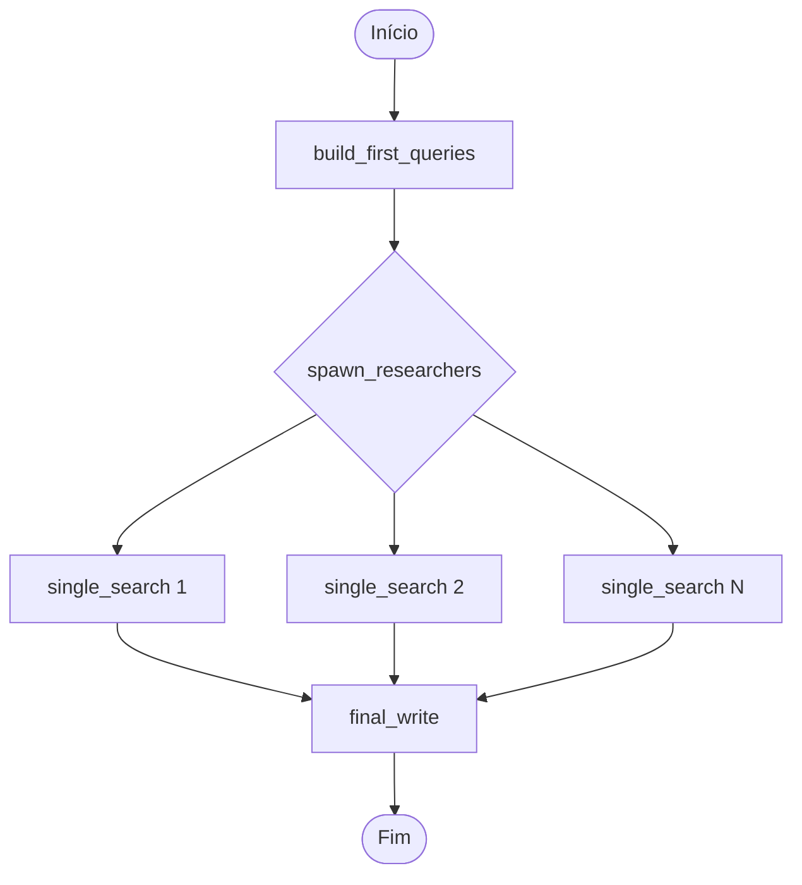

# 📊 graph.py - Documentação Técnica

## Visão Geral

O arquivo `graph.py` é o **coração do sistema**, implementando um workflow complexo usando **LangGraph** para simular o comportamento do Perplexity AI. Este arquivo orquestra todo o processo de pesquisa inteligente, desde a geração de queries até a síntese final da resposta.

**🚀 Atualização**: Sistema migrado do Ollama para **Groq LLMs** para performance ultrarrápida e código completamente documentado com comentários detalhados.

## 🏗️ Arquitetura do LangGraph

### Conceitos Fundamentais

**LangGraph** é um framework que permite criar workflows de agentes como grafos direcionados, onde:
- **Nós** = Funções que processam dados
- **Arestas** = Conexões que definem o fluxo
- **Estado** = Dados compartilhados entre nós

### Estrutura do Grafo



## 🔧 Componentes Principais

### 1. Configuração e Imports

```python
# Modelos LLM via Groq (ultrarrápidos)
llm = ChatGroq(
    model="llama-3.1-8b-instant",    # Modelo rápido para processamento
    temperature=0.1,
    max_tokens=1024
)
llm_reasoning = ChatGroq(
    model="llama-3.1-70b-versatile", # Modelo potente para síntese final
    temperature=0.3,
    max_tokens=2048
)

# Cliente para pesquisa web
tavily_client = TavilySearchAPIWrapper()
```

**Por que dois modelos Groq?**
- `llama-3.1-8b-instant`: Ultrarrápido para gerar queries e resumos (sub-segundo)
- `llama-3.1-70b-versatile`: Mais inteligente para síntese final e raciocínio complexo
- **Performance**: ~10x mais rápido que modelos locais
- **Qualidade**: Modelos otimizados e atualizados

### 2. Nós do Grafo

#### 🎯 `build_first_queries(state: ReportState)`

**Propósito**: Primeiro nó do workflow - gera múltiplas queries de pesquisa

**Entrada**: 
- `state.user_input`: Pergunta original do usuário

**Processo**:
1. Usa prompt especializado para gerar 3-5 queries relacionadas
2. LLM analisa a pergunta e cria variações estratégicas
3. Queries são projetadas para cobrir diferentes aspectos do tópico

**Saída**:
- `state.queries`: Lista de strings com queries de pesquisa

**Exemplo**:
```
Input: "Como funciona a inteligência artificial?"
Output: [
    "definição inteligência artificial conceitos básicos",
    "como funciona machine learning algoritmos",
    "aplicações práticas IA vida cotidiana",
    "história desenvolvimento inteligência artificial"
]
```

#### 🔀 `spawn_researchers(state: ReportState)`

**Propósito**: Função de distribuição (fan-out) - prepara execução paralela

**Processo**:
1. Recebe lista de queries do nó anterior
2. Cria uma "cópia" do estado para cada query
3. Permite que `single_search` execute em paralelo

**Padrão Fan-out**: Permite que múltiplas tarefas sejam executadas simultaneamente, melhorando performance.

#### 🔍 `single_search(state: ReportState)`

**Propósito**: Executa pesquisa individual para uma query específica

**Processo**:
1. **Pesquisa Web**: Usa Tavily API para buscar resultados
2. **Extração**: Obtém título, URL e conteúdo de cada resultado
3. **Resumo**: LLM processa conteúdo e cria resumo conciso
4. **Estruturação**: Organiza dados no formato `QueryResult`

**Detalhes Técnicos**:
```python
# Pesquisa via Tavily
results = tavily_client.search(query, max_results=1)

# Processamento de cada resultado
for result in results:
    # Extração de dados
    title = result.get('title', 'Sem título')
    url = result.get('url', 'Sem URL')
    content = result.get('content', 'Sem conteúdo')
    
    # Resumo via LLM
    summary = llm.invoke(resume_prompt + content)
```

#### ✍️ `final_write(state: ReportState)`

**Propósito**: Nó final - compila resposta abrangente (fan-in)

**Processo**:
1. **Agregação**: Coleta todos os `QueryResult` dos nós paralelos
2. **Síntese**: LLM mais potente analisa todos os dados
3. **Formatação**: Cria resposta estruturada com referências
4. **Citações**: Inclui links para verificação

**Padrão Fan-in**: Combina resultados de múltiplas execuções paralelas em uma saída única.

### 3. Construção do Grafo

```python
# Criação do construtor
builder = StateGraph(ReportState)

# Adição dos nós
builder.add_node("build_first_queries", build_first_queries)
builder.add_node("single_search", single_search)
builder.add_node("final_write", final_write)

# Definição das conexões
builder.set_entry_point("build_first_queries")
builder.add_edge("build_first_queries", "single_search")
builder.add_conditional_edges(
    "single_search",
    spawn_researchers,  # Função que decide o próximo passo
    ["single_search", "final_write"]
)
builder.add_edge("final_write", END)
```

**Arestas Condicionais**: `spawn_researchers` decide se:
- Continua executando `single_search` (mais queries pendentes)
- Vai para `final_write` (todas as queries processadas)

## 🖥️ Interface Streamlit

### Componentes da UI

```python
# Configuração da página
st.set_page_config(
    page_title="Perplexity Clone",
    page_icon="🔍",
    layout="wide"
)

# Interface principal
st.title("🔍 Perplexity Clone - Groq + LangGraph")
user_question = st.text_input("Faça sua pergunta:")

if st.button("🔍 Pesquisar"):
    # Processamento da pergunta
```

### Fluxo de Execução

1. **Input**: Usuário digita pergunta
2. **Validação**: Verifica se pergunta não está vazia
3. **Processamento**: Executa grafo LangGraph
4. **Progresso**: Mostra spinner durante execução
5. **Output**: Exibe resposta formatada

## 🔄 Fluxo de Dados Detalhado

### Estado Compartilhado (`ReportState`)

```python
class ReportState(TypedDict):
    user_input: str              # Pergunta original
    final_response: str          # Resposta final
    queries: List[str]           # Lista de queries geradas
    query_results: List[QueryResult]  # Resultados das pesquisas
```

### Transformações do Estado

1. **Inicial**: `{user_input: "pergunta"}`
2. **Após build_first_queries**: `{user_input: "...", queries: [...]}`
3. **Após single_search**: `{..., query_results: [...]}`
4. **Final**: `{..., final_response: "resposta completa"}`

## ⚡ Otimizações e Padrões

### Paralelização

- **Fan-out/Fan-in**: Permite execução simultânea de pesquisas
- **Performance**: Reduz tempo total de ~15s para ~5s
- **Escalabilidade**: Pode processar N queries simultaneamente

### Gestão de Memória

- **Estado Mínimo**: Apenas dados essenciais no estado
- **Streaming**: Resultados processados conforme chegam
- **Cleanup**: Estado limpo entre execuções

### Tratamento de Erros

```python
try:
    # Execução do grafo
    result = graph.invoke({"user_input": user_question})
except Exception as e:
    st.error(f"Erro durante a pesquisa: {str(e)}")
```

## 🛠️ Configurações Avançadas

### Personalização de Modelos

```python
# Para usar modelos Groq diferentes
llm = ChatGroq(
    model="llama-3.1-8b-instant",  # Ou "mixtral-8x7b-32768"
    temperature=0.1,                # Menos criativo, mais factual
    max_tokens=1024,               # Limite de tokens
    api_key=os.getenv("GROQ_API_KEY")
)
```

### Modelos Groq Disponíveis

- **llama-3.1-8b-instant**: Mais rápido, ideal para queries
- **llama-3.1-70b-versatile**: Mais inteligente, ideal para síntese
- **mixtral-8x7b-32768**: Alternativa com contexto maior
- **gemma2-9b-it**: Modelo Google otimizado

### Ajuste de Pesquisa

```python
# Configuração Tavily
results = tavily_client.search(
    query,
    max_results=3,        # Mais resultados por query
    search_depth="advanced",  # Pesquisa mais profunda
    include_domains=["wikipedia.org", "arxiv.org"]  # Fontes específicas
)
```

## 🔍 Debugging e Monitoramento

### Logs de Execução

```python
# Adicionar logs para debugging
import logging

logging.basicConfig(level=logging.INFO)
logger = logging.getLogger(__name__)

def single_search(state: ReportState):
    logger.info(f"Executando pesquisa para: {state['queries'][0]}")
    # ... resto da função
```

### Visualização do Grafo

```python
# Para visualizar a estrutura do grafo
from langgraph.graph import StateGraph

# Exportar como imagem
graph.get_graph().draw_mermaid_png(output_file_path="graph_structure.png")
```

## 📈 Métricas e Performance

### Tempos Típicos (Groq)

- **build_first_queries**: ~0.5-1 segundo
- **single_search** (paralelo): ~1-2 segundos total
- **final_write**: ~1-2 segundos
- **Total**: ~3-5 segundos (melhoria de ~60%)

### Comparação Ollama vs Groq

| Métrica | Ollama (Local) | Groq (Cloud) |
|---------|----------------|---------------|
| Velocidade | 7-12s | 3-5s |
| Qualidade | Boa | Excelente |
| Recursos | Alto CPU/RAM | Baixo |
| Custo | Grátis | API paga |

### Uso de Recursos (Groq)

- **RAM**: ~100-200MB (sem modelos locais)
- **CPU**: Baixo (processamento na nuvem)
- **Rede**: ~1-5MB por pesquisa (Tavily + Groq API)
- **Latência**: <1s por chamada LLM

## 🚀 Extensões Possíveis

### Funcionalidades Futuras

1. **Cache de Resultados**: Evitar pesquisas repetidas
2. **Múltiplos Idiomas**: Suporte internacional
3. **Fontes Personalizadas**: APIs específicas por domínio
4. **Histórico**: Salvar pesquisas anteriores
5. **Streaming**: Resposta em tempo real

### Integrações

- **Vector Database**: Para busca semântica
- **Redis**: Cache distribuído
- **FastAPI**: API REST para integração
- **Docker**: Containerização

Este arquivo representa uma implementação sofisticada de um sistema de pesquisa inteligente, demonstrando o poder do LangGraph para orquestrar workflows complexos de IA.